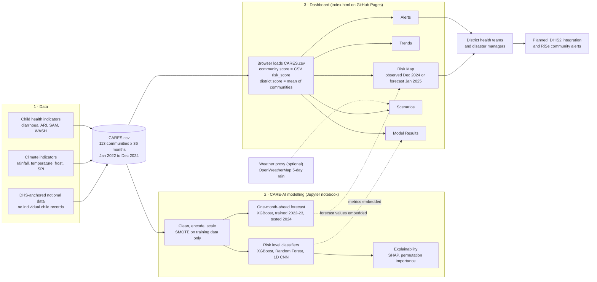

<div align="center">

# CARES

### Climate Anticipatory Risk and Early Warning System

**AI-powered anticipatory intelligence for child health in Lesotho**

[](https://davidmothae3.github.io/caresai-test/)
[](#limitations-and-responsible-use)
[](#data)
[](LICENSE)

TitaniumX Group | Mohloli Digital and Innovation Hub

</div>

> [!WARNING]
> **Prototype built on notional, DHS-anchored data.** CARES does not use individual child records and is **not** a validated clinical or epidemiological prediction system. Outputs are for demonstration and require human review.

---

## Contents

1. [Overview](#overview)
2. [How it works](#how-it-works)
3. [Dashboard](#dashboard)
4. [Data](#data)
5. [Models and results](#models-and-results)
6. [Technology stack](#technology-stack)
7. [Repository structure](#repository-structure)
8. [Run it locally](#run-it-locally)
9. [Configuration](#configuration)
10. [Roadmap](#roadmap)
11. [Limitations and responsible use](#limitations-and-responsible-use)
12. [License](#license)

---

## Overview

Children across Lesotho face a growing convergence of climate-sensitive health threats: diarrhoeal disease, acute respiratory infections, hypothermia and severe acute malnutrition. These risks are shaped by poverty and access to services, and also by rainfall anomalies, drought, temperature drops, flooding and snow-related road disruption. Very few climate and health platforms have been designed from within Lesotho to anticipate them before they escalate.

CARES is an open-source platform built to answer one operational question:

> *Given current and forecast climate conditions, what child health risks are likely to emerge, where will they occur, and what action should be taken before impacts escalate?*

It combines climate data, child health indicators, geospatial analysis, machine learning and explainable AI to produce:

- **District and community risk classifications** (Low, Medium, High)
- **Preparedness alerts** with suggested actions
- **Decision-support views**: trends, scenarios and model transparency

Its predictive engine, **CARE-AI**, identifies elevated-risk areas before disease burden increases. The architecture is modular and designed for future DHIS2 integration. A planned community alert layer, **RiSe**, is intended for community health workers and local response systems.

CARES has moved beyond concept into a working prototype developed in Lesotho by TitaniumX Group, as the flagship platform of the Mohloli innovation ecosystem: an Africa-built digital public infrastructure concept grounded in local disease burden, local data realities and local ownership.

---

## How it works



**In short:** `CARES.csv` is the single source of data. The notebook trains and evaluates the models on it, and the dashboard reads the same file directly in the browser. Forecast values and model metrics produced by the notebook are embedded in the dashboard page.

---

## Dashboard

**Live:** <https://davidmothae3.github.io/caresai-test/>

| Tab | What it shows |
|---|---|
| **Risk Map** | District and community risk on a map. Switch between **Observed (Dec 2024)** and **Forecast (Jan 2025)**. Forecast view adds an 80% range and a chance of High. High-risk communities blink; unverified locations are shown dashed. |
| **Trends** | Monthly district risk for 2024. |
| **Alerts** | Districts ranked by risk with indicators, suggested actions and a downloadable alert JSON. |
| **Scenarios** | What-if adjustments (rain, cold snap, snow) applied to a district's current score. Rule-based, not a model. |
| **Model Results** | Classifier comparison, forecast accuracy against simple baselines, and an explicit list of what the results do and do not show. |

**Risk bands** (used on the map, in lists and in alerts):

| Level | Score |
|---|---|
| 🔴 High | 70 and above |
| 🟠 Medium | 45 to 69 |
| 🟢 Low | below 45 |

Communities are listed highest risk first.

---

## Data

`CARES.csv` holds one row per community per month.

| | |
|---|---|
| **Coverage** | 10 districts, 113 community units, Jan 2022 to Dec 2024 (4,068 rows) |
| **Climate** | `rainfall_mm`, `temperature_min_c` / `max_c` / `mean_c`, `frost_days`, `spi_drought_index`, `snow_access_risk` |
| **Child health** | `diarrhoea_rate_per1000`, `ari_rate_per1000`, `sam_rate_per1000` (plus case counts) |
| **Services and context** | `safe_water_pct`, `improved_sanit_pct`, `stunting_pct_dhs`, `wasting_pct_dhs`, `mean_altitude_m`, `urban_pct`, `u5_population`, `elevation_zone`, `highland` |
| **Targets** | `risk_score` (0 to 100) and `risk_level` (Low, Medium, High) |

**How the dashboard aggregates it:** the "now" view uses the latest month. A community's score is its own `risk_score`. A district's score is the simple mean of its communities, and its population is the sum.

> [!NOTE]
> The data is notional and DHS-anchored. Keep the file named `CARES.csv` in the repository root, because the dashboard requests it by that name.

---

## Models and results

### Same-month risk classification

Predicts `risk_level` (Low, Medium, High) on 814 held-out records (80/20 split, SMOTE applied to training data only).

| Model | Test accuracy | Weighted ROC-AUC | Macro F1 | High-risk recall | High-risk precision |
|---|---|---|---|---|---|
| **XGBoost** (best) | **0.9705** | **0.9954** | **0.96** | 0.96 | 0.90 |
| Random Forest | 0.9459 | 0.9877 | 0.92 | 0.86 | 0.88 |
| 1D CNN | 0.9312 | 0.9871 | 0.90 | 0.96 | 0.76 |

The 1D CNN's 5-fold cross-validation accuracy is 95.77% (± 0.65%). These figures match the **Model Results** tab of the dashboard.

**Consistent drivers across models:** `diarrhoea_rate_per1000`, `ari_rate_per1000`, `sam_rate_per1000`, `rainfall_mm`, `temperature_mean_c`, `urban_pct`, `mean_altitude_m`, and infrastructure indicators (`safe_water_pct`, `improved_sanit_pct`). Importance was assessed with permutation importance and SHAP (CNN) and intrinsic importance (Random Forest, XGBoost).

### One-month-ahead forecast

An XGBoost model that uses only information available before the month being predicted. Trained on 2022 to 2023 and tested on 2024 (1,356 community-months it never saw).

| Method | Score error (MAE, lower is better) | Level accuracy | High-risk ranking (AUC) |
|---|---|---|---|
| Persistence (next month = this month) | 7.63 | 69.7% | 0.824 |
| Climatology (average for that month) | 6.26 | 74.8% | 0.782 |
| Seasonal naive (same month last year) | 7.49 | 69.8% | 0.824 |
| **XGBoost forecast** | **5.32** | **80.2%** | **0.887** |

At district level the forecast error is 3.79 against 5.88 for persistence.

**Forecast model drivers:** the one-month-ahead model relies most on `frost_days` (importance 0.28), then `temperature_mean_c`, `stunting_pct_dhs`, month-of-year seasonality and `diarrhoea_rate_per1000`.

> [!IMPORTANT]
> These are strong results on notional data, not evidence of real-world performance. See the limitations below.

---

## Technology stack

| Layer | Tools |
|---|---|
| **Data handling** | pandas, NumPy |
| **Visualisation (notebook)** | Matplotlib, Seaborn |
| **Classical ML** | scikit-learn (train/test split, scaling, Random Forest, metrics, K-fold), imbalanced-learn (SMOTE) |
| **Gradient boosting** | XGBoost |
| **Deep learning** | TensorFlow / Keras (1D CNN: Conv1D, MaxPooling1D, Flatten, Dense, Dropout) |
| **Explainability** | SHAP (GradientExplainer), ELI5 (permutation importance) |
| **Dashboard** | Vanilla HTML, CSS and JavaScript, Leaflet and marker clustering, Turf.js, Chart.js |
| **Weather (optional)** | OpenWeatherMap through a small Cloudflare Worker proxy |
| **Hosting** | GitHub Pages |

---

## Repository structure

```
caresai-test/
├── index.html                          # The dashboard (single file, served by GitHub Pages)
├── CARES.csv                           # Dataset: read by the dashboard and the notebook
├── config.js                           # Optional dashboard settings (weather proxy)
├── worker.js                           # Optional Cloudflare Worker that hides the weather API key
├── Climate_Health_Risk_Kids_Under_5.ipynb   # Modelling notebook
├── README.md
└── LICENSE
```

---

## Run it locally

The dashboard loads `CARES.csv` with `fetch`, so open it through a local web server, not by double-clicking the file.

```bash
git clone https://github.com/davidmothae3/caresai-test.git
cd caresai-test
python -m http.server 8000
# open http://localhost:8000
```

The header badge shows where the data came from: `Data: CARES.csv · 2024-12`. If the CSV cannot be loaded, the page falls back to an embedded copy of the December 2024 data and the badge turns amber.

---

## Configuration

`config.js` is optional. With empty values the dashboard works fully, and the weather panel simply reads "not configured".

```js
window.CARES_CONFIG = {
  wxProxy: 'https://your-worker.workers.dev', // recommended
  owmKey: ''                                  // private local testing only
};
```

> [!CAUTION]
> `config.js` is public on GitHub Pages. **Never commit a real OpenWeatherMap key.** Deploy `worker.js` as a Cloudflare Worker, store the key there as a secret named `OWM_KEY`, and put only the Worker URL in `wxProxy`.

The 5-day rainfall forecast shown in the weather panel is informational and is **not** used in the risk score.

---

## Roadmap

- [x] Working prototype with district and community risk mapping
- [x] Explainable models and out-of-sample forecast evaluation
- [x] Dashboard-based alert generation
- [ ] DHIS2 integration, subject to Ministry of Health data access clearance
- [ ] **RiSe** community alert layer for community health workers
- [ ] Validation on real surveillance data
- [ ] Time-based and district-held-out evaluation
- [ ] Phased national scale-up and adaptation to other climate-vulnerable settings

---

## Limitations and responsible use

- **Notional data.** Results describe model behaviour on a constructed dataset, not real-world accuracy.
- **Random split for classification.** Rows from the same communities and months appear in both training and test sets, so the same-month classifier scores are optimistic. A fair test would hold out whole months or districts.
- **Classification is not forecasting.** The same-month classifiers label the current period. Only the XGBoost forecast looks ahead, and its horizon is **one month** because the data is monthly. It does not support a 14-day window.
- **One test year.** Three years of history is thin. Treat differences between methods as indicative, not proven.
- **False alarms.** A watch flag at a score of 60 catches about 87% of High months, but only about 1 in 5 flagged months turns out High.
- **Location accuracy.** Some community map positions are approximate and are shown with dashed markers.
- **Human review required.** Outputs support decisions; they do not replace public health judgement.

---

## License

Released under the [MIT License](LICENSE). Copyright (c) 2026 TitaniumX Group (Pty) Ltd.

<div align="center">

**Built in Lesotho by TitaniumX Group · Mohloli Digital and Innovation Hub**

</div>
